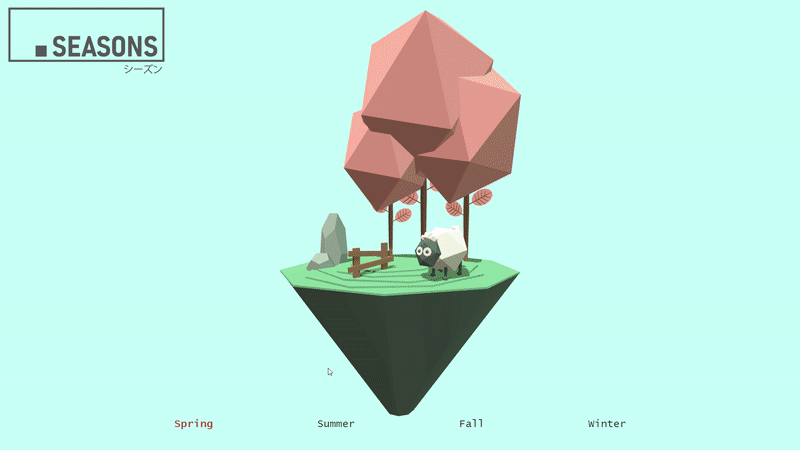

# Four Season
Four season simulator using Three.js 



How to run:

``` bash
# Install dependencies (only the first time)
npm install

# Run the local server at localhost:8080
npm run dev

# Build for production in the dist/ directory
npm run build
```


base model from : [41| Low Poly 🐑Sheepfold with three.js](https://codepen.io/yitliu/pen/gOaPxRX) by [@yitliu](https://codepen.io/yitliu)
